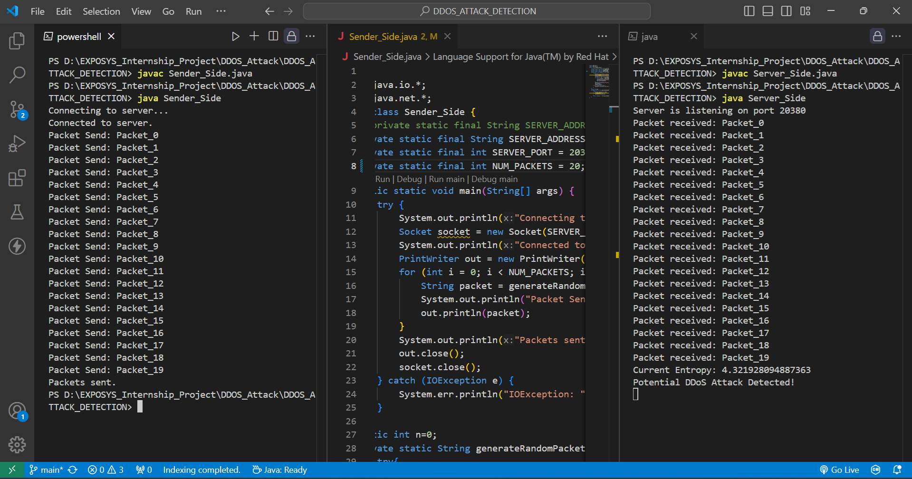

# Distributed Denial of Service (DDoS) Attack Detection Using Entropy Computing

## Overview

The Distributed Denial of Service (DDoS) attack is a significant threat to internet servers. It occurs when a large number of users simultaneously access a target, overwhelming the server and causing disruptions. Detecting such attacks can be challenging due to their nature and scale.

This project aims to identify DDoS attacks using entropy computing to determine the accuracy of an attack.

## Table of Contents

- [Overview](#overview)
- [Features](#features)
- [Installation](#installation)
- [Usage](#usage)
- [Contributing](#contributing)
- [License](#license)
- [Screenshots](#screenshots)

## Features

- Detect DDoS attacks using entropy-based methods
- Calculate the accuracy of attack detection
- Visualize the detection process

## Installation

1. Clone the repository:
    ```sh
    git clone https://github.com/yourusername/ddos-attack-detection.git
    ```
2. Change to the project directory:
    ```sh
    cd ddos-attack-detection
    ```
3. Install the required dependencies:
    ```sh
    pip install -r requirements.txt
    ```

## Usage

1. Prepare your dataset with network traffic data.
2. Run the detection script:
    ```sh
    python detect_ddos.py
    ```
3. View the results and accuracy of the detection.

## Contributing

We welcome contributions to improve this project. Please fork the repository and submit a pull request with your changes.

## Screenshots




